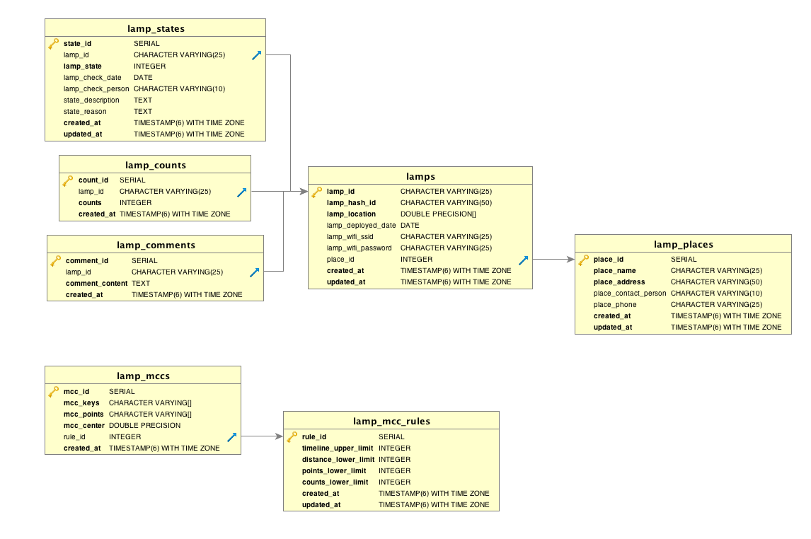

# Bucket-API
Dengue Lamps & Minimal covering circle API


[](https://snyk.io/test/github/sirius207/bucket-api)
[](https://codeclimate.com/github/Sirius207/Bucket-API)

## Outline
- [ChangeLog](https://github.com/Sirius207/Bucket-API#changelog)
- [Setup](https://github.com/Sirius207/Bucket-API#setup)
- [API Document](https://github.com/Sirius207/Bucket-API#api-document)
- [Database Diagram](https://github.com/Sirius207/Bucket-API#database-diagram)
- [Table Overview](https://github.com/Sirius207/Bucket-API#table-overview)
- [Table Details](https://github.com/Sirius207/Bucket-API#table-details)
	- [lamps](https://github.com/Sirius207/Bucket-API#table-lamps)
	- [lamp_places](https://github.com/Sirius207/Bucket-API#table-lamp_places)
	- [lamp_counts](https://github.com/Sirius207/Bucket-API#table-lamp_counts)
	- [lamp_states](https://github.com/Sirius207/Bucket-API#table-lamp_states)
	- [lamp_mcc](https://github.com/Sirius207/Bucket-API#table-lamp_mcc)
	- [lamp_mcc\_rules](https://github.com/Sirius207/Bucket-API#table-lamp_mcc_rules)
	- [lamp_comments](https://github.com/Sirius207/Bucket-API#table-lamp_comments)


## ChangeLog

- v0.9.2 (Dev Branch)
	- Add Tables: lamps_meta, user, notification
	- Add JWT of post, put, delete request

- v0.9.1 (Master Branch)
	- With RESTful API of Lamps, Places, Counts, States, Mcc, Rules, Comments
	- With Lamp MQTT message Subscribe


## Setup

### Prerequisite
- Node.js: '^7.6.0'
- PostgreSQL: '^9.3'


### 1. Install Dependency

```
$ yarn install // or npm install
```

### 2. Setup Secret Data

- Create Dev DB & user. Check [here](https://www.digitalocean.com/community/tutorials/how-to-install-and-use-postgresql-on-ubuntu-16-04)
- Setup your environment variables ```DATABASE```, ```USER```, ```PASSWORD``` in config/lampDevConfig.js & config/lampProdConfig.js

### 3. Initialize Dev Tables
***It will Drop  Dev tables if these already exist***

```
$ node config/dbInitialize.js
```


### 4. Run Locally (Dev)
- Use dev database

```
$ npm start
```

### 5. Run Test
- Test Each RESTful API

```
$ npm test
```

---

### Run Locally (Prod)
Use Production Database

```
$ export NODE_ENV=production
$ npm run prod
```

### Run Lamp Mqtt Subscribe

```
$ npm install -g pm2
$ cd mqttSub
$ pm2 start   ecosystem.config.js --only Lamp_Sub
```
- check Mqtt Log
```
$ pm2 logs Lamp_Sub
```


## API Document

### Check [API Document Site](https://sirius207.github.io/Bucket-API/index.html)

### Modify API Document Site

Modify api.apib

```
$ npm install -g aglio
$ aglio --theme-variables streak  -i api.apib --theme-template triple -o index.html
```

## Database Diagram



## Table Overview

- v0.9.1 Tables(7)

| Table Name     | Description | Remarks |
| -------------- | ----------- | ------- |
| lamps          | 捕蚊燈相關資料     |         |
| lamp_places    | 捕蚊燈部署店家相關資料 |         |
| lamp_counts    | 捕蚊燈捕獲數目     |         |
| lamp_states    | 捕蚊燈狀態       |         |
| lamp_mcc       | 密集處包含圓      |         |
| lamp_mcc\_rules | 包含圓產生規則     |         |
| lamp_comments  | 捕蚊燈店家留言     |         |

## Table Details

### Table: lamps

| Field              | Type               | Null | Key | Default | Remarks |
| ------------------ | ------------------ | ---- | --- | ------- | ------- |
| lamp_id            | varchar(25)        |      | PRI |         |         |
| lamp_hash\_id      | varchar(64)        |      |     |         | SHA-256 with secret |
| lamp_location      | [double precision] |      |     |         |         |
| lamp_deployed\_date | date               | YES  |     | NULL    | 捕蚊燈部署日期 |
| lamp_wifi\_ssid     | varchar(25)        | YES  |     | NULL    |         |
| lamp_wifi\_password | varchar(25)        | YES  |     | NULL    |         |
| place_id           | integer              |      | IND |         |         |
| created_at         | timestamp          |      |     |         |         |
| updated_at         | timestamp          |      |     |         |         |


### Index

| Keyname  | Type    | Field    |
| -------- | ------- | -------- |
| lamp_id  | PRIMARY | lamp_id  |
| place_id | INDEX   | place_id |


---


### Table: lamp_places

| Field                | Type        | Null | Key | Default | Extra          | Remarks |
| -------------------- | ----------- | ---- | --- | ------- | -------------- | ------- |
| place_id             | integer       |      | PRI |         | auto_increment |         |
| place_name           | varchar(25) |      |     |         |                |         |
| place_address        | varchar(50) |      |     |         |                |         |
| place_contact\_person| varchar(10) | YES  |     | NULL    |                | 聯絡人     |
| place_phone          | varchar(25) | YES  |     | NULL    |                |         |
| created_at           | timestamp   |      |     |         |                |         |
| updated_at           | timestamp   |      |     |         |                |         |


### Index

| Keyname  | Type    | Field    |
| -------- | ------- | -------- |
| place_id | PRIMARY | place_id |

---

### Table: lamp_counts

| Field      | Type        | Null | Key | Default | Extra          | Remarks |
| ---------- | ----------- | ---- | --- | ------- | -------------- | ------- |
| count_id   | integer     |      | PRI |         | auto_increment |         |
| lamp_id    | varchar(25) |      | IND |         |                |         |
| counts     | integer     |      |     |         |                |         |
| created_at | timestamp   |      | IND |         |                |         |


### Index

| Keyname    | Type    | Field      |
| ---------- | ------- | ---------- |
| count_id   | PRIMARY | count_id   |
| lamp_id    | INDEX   | lamp_id    |
| created_at | INDEX   | created_at |


---

### Table: lamp_states


| Field             | Type        | Null | Key | Default | Extra          | Remarks                       |
| ----------------- | ----------- | ---- | --- | ------- | -------------- | ----------------------------- |
| state_id          | integer     |      | PRI |         | auto_increment |                               |
| lamp_id           | varchar(25) |      | IND |         |                |                               |
| lamp_state        | integer     |      | IND |         |                | 捕蚊燈狀態: 2: 檢查中, 1: 異常待查, 0: 正常 |
| lamp_check_date   | date        | YES  |     | NULL    |                | 檢查日期                          |
| lamp_check_person | varchar(10) | YES  |     | NULL    |                | 檢查者                           |
| state_description | text        | YES  |     | NULL    |                | 異常狀況                          |
| state_reason      | text        | YES  |     | NULL    |                | 異常原因                          |
| created_at        | timestamp   |      |     |         |                |                               |
| updated_at        | timestamp   |      |     |         |                |                               |


### Index

| Keyname    | Type    | Field      |
| ---------- | ------- | ---------- |
| state_id   | PRIMARY | state_id   |
| lamp_id    | INDEX   | lamp_id    |
| lamp_state | INDEX   | lamp_state |

---

### Table: lamp_mcc

| Field      | Type          | Null | Key | Default | Extra          | Remarks |
| ---------- | ------------- | ---- | --- | ------- | -------------- | ------- |
| mcc_id     | integer       |      | PRI |         | auto_increment |         |
| mcc_keys   | [varchar(25)] |      |     |         |                | 包含圓邊界點  |
| mcc_points | [varchar(25)] |      |     |         |                | 包含圓包含點  |
| mcc_center | [double]      |      |     |         |                | 包含圓中心座標 |
| rule_id    | integer       |      |     |         |                |         |
| created_at | timestamp     |      | IND |         |                |         |


### Index

| Keyname    | Type    | Field      |
| ---------- | ------- | ---------- |
| mcc_id     | PRIMARY | mcc_id     |
| created_at | IND     | created_at |


---

### Table: lamp_mcc\_rules

| Field                 | Type      | Null | Key | Default | Extra          | Remarks   |
| --------------------  | --------- | ---- | --- | ------- | -------------- | --------- |
| rule_id               | integer   |      | PRI |         | auto_increment |           |
| timeline_upper\_limit | integer   |      |     |         |                | 幾天內       |
| distance_lower\_limit | integer   |      |     |         |                | 圓半徑       |
| points_lower\_limit   | integer   |      |     |         |                | 最少點數目     |
| counts_lower\_limit   | integer   |      |     |         |                | 單一點最少捕獲數目 |
| created_at            | timestamp |      |     |         |                |           |
| updated_at            | timestamp |      |     |         |                |           |


### Index

| Keyname | Type    | Field   |
| ------- | ------- | ------- |
| rule_id | PRIMARY | rule_id |


---

### Table: lamp_comments

| Field           | Type        | Null | Key | Default | Extra          | Remarks |
| --------------- | ----------- | ---- | --- | ------- | -------------- | ------- |
| comment_id      | integer     |      | PRI |         | auto_increment |         |
| lamp_id         | varchar(25) |      | IND |         |                |         |
| comment_content | text        |      |     |         |                |         |
| created_at      | timestamp   |      |     |         |                | 留言日期    |


### Index

| Keyname    | Type    | Field      |
| ---------- | ------- | ---------- |
| comment_id | PRIMARY | comment_id |
| lamp_id    | INDEX   | lamp_id    |

## License

MIT © [Pochun](./LICENSE)

[](https://github.com/standard/standard)
